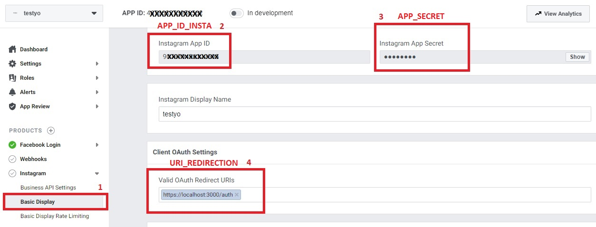

# api_graph_instagram_test


# Install Yarn :

## Setting :
```
yarn

```

## Create : .env with 
```
APP_ID_INSTA="APP_ID"
URI_REDIRECTION=https://localhost:3000/auth
APP_SECRET="APP SECRET "

```
Help for configuration .env:


## RUN:
```
yarn start
```
for redirection
"ngrok http localhost:3000"